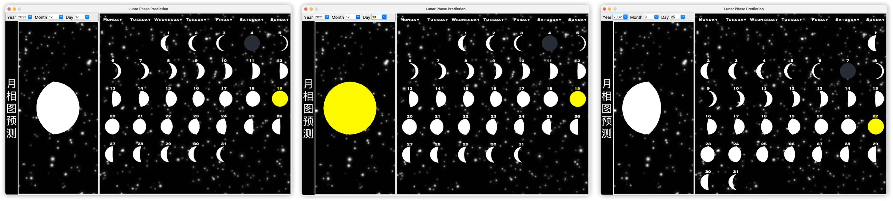
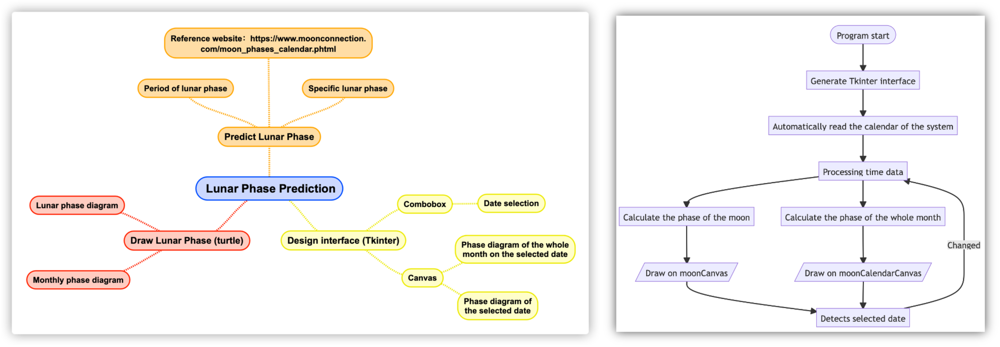

  
  <h1 style="text-align: center;">Lunar Phase Predictor</h1>

A Python-based application that **accurately predicts and visualizes** the phases of the moon using the Turtle and
Tkinter modules, allowing users to explore moon phases for any selected date.

这里是优化后的程序表达：

1. When the program starts, it automatically displays the moon phase for the current day and the entire current month.
2. Real-time detection of user-selected month, year, and day.
3. Upon detecting a change in the year or month, the program updates the lunar phase diagram for the current month and
   the selected month, as well as the list of available dates (taking into account the varying number of days in each
   month and leap years).
4. When a date change is detected, only the lunar phase diagram for the selected date is updated, avoiding unnecessary
   recalculations for the current month.

# Main Features

- Making interactive interface with Tkinter.
- The interface is composed of comobox, canvas and label.
- Use turtle to draw on canvas.
- Automatically redraw the lunar phase diagram when the user changes the options.

- [x] The non-integer nature of the lunar phase period makes it challenging to calculate the moon phase for a specific
  date.
- [x] Utilize the Turtle module to draw the moon phase.
- [x] Embed the Turtle module's image into the Tkinter interface.
- [x] Automatically detect the current date and display the corresponding moon phase diagram.
- [x] Provide an option to automatically update the list of available dates when the user changes the year and month.

# Design Scheme

> Module Diagram and Flow Chart

# Instructions

> It should be noted that the program will automatically calculate the current date list every time the month and year
> are changed to ensure that the user will not select "non-existent date", such as February 30.

1. Preparation:
    - Install the turtle, calendar, datetime and tkinter modules.
    - Run the main.py to view the phase of the moon.
2. Use:
    - Change the date freely, and the monthly phase will change automatically.
    - Change the year or month, the phase of the whole month and the phase of the current day will change accordingly.